# 📄 ReportIQ – AI-Based Document Intelligence Application

<p align="center">
  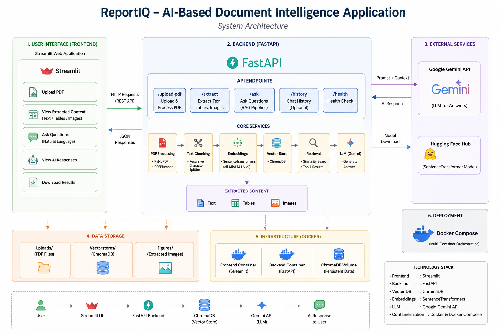
</p>

<p align="center">


</p>

---

# 🚀 Project Overview

**ReportIQ** is an AI-powered Document Intelligence Application that allows users to upload PDF documents and ask natural language questions about their content.

The system uses:

* 📄 PDF Parsing
* 🧠 Retrieval-Augmented Generation (RAG)
* 🔍 Semantic Search
* 📚 Chroma Vector Database
* 🤖 Google Gemini LLM
* ⚡ FastAPI Backend
* 🎨 Streamlit Frontend
* 🐳 Docker Containerization

to provide intelligent answers directly from uploaded documents.

---

# 🎯 Key Features

✅ Upload PDF documents

✅ Extract text from PDFs

✅ Generate vector embeddings

✅ Store embeddings in ChromaDB

✅ Semantic document retrieval

✅ Context-aware question answering

✅ Google Gemini integration

✅ FastAPI REST APIs

✅ Streamlit User Interface

✅ Dockerized deployment

---

# 🏗️ System Architecture

<p align="center">
  
</p>

---

# 📂 Project Structure

```text
ReportIQ-AI/
│
├── backend/
│   ├── app/
│   ├── Dockerfile
│   ├── requirements.txt
│   └── .dockerignore
│
├── frontend/
│   ├── streamlit_app.py
│   ├── Dockerfile
│   ├── requirements.txt
│   └── .dockerignore
│
├── assets/
│   ├── architecture.png
│   ├── fastapi_swagger_ui_1.png
│   ├── fastapi_swagger_ui_2.png
│   ├── fastapi_swagger_ui_3.png
│   ├── fastapi_swagger_ui_4.png
│   ├── fastapi_swagger_ui_5.png
│   ├── fastapi_swagger_ui_6.png
│   ├── streamlit_app_1.png
│   ├── streamlit_app_2.png
│   ├── streamlit_app_3.png
│   └── streamlit_app_4.png
│
├── uploads/
├── vectorstores/
├── figures/
│
├── docker-compose.yml
├── .gitignore
├── README.md
└── .env
```

---

# 🛠️ Tech Stack

| Component            | Technology       |
| -------------------- | ---------------- |
| Programming Language | Python           |
| Backend              | FastAPI          |
| Frontend             | Streamlit        |
| Vector Database      | ChromaDB         |
| Embedding Model      | all-MiniLM-L6-v2 |
| LLM                  | Google Gemini    |
| Containerization     | Docker           |
| API Documentation    | Swagger UI       |

---

## 🚀 Installation & Setup

### 1️⃣ Clone Repository

```bash
git clone https://github.com/<your-username>/reportiq-ai-document-intelligence.git
cd reportiq-ai-document-intelligence
```

---

### 2️⃣ Create Conda Environment

```bash
conda create -n reportiq_env python=3.10 -y
```

Activate environment:

```bash
conda activate reportiq_env
```

---

### 3️⃣ Install Backend Dependencies

```bash
cd backend
pip install -r requirements.txt
cd ..
```

---

### 4️⃣ Install Frontend Dependencies

```bash
cd frontend
pip install -r requirements.txt
cd ..
```

---

### 5️⃣ Configure Environment Variables

Create a `.env` file in the project root directory:

```env
GEMINI_API_KEY=YOUR_GEMINI_API_KEY
```

Get your Gemini API key from:

https://aistudio.google.com/app/apikey

---


# ▶️ Run FastAPI Backend

Navigate to project root:

```bash
uvicorn backend.app.main:app --reload
```

Open:

```text
http://localhost:8000/docs
```

---

# ▶️ Run Streamlit Frontend

```bash
streamlit run frontend/streamlit_app.py
```

Open:

```text
http://localhost:8501
```

---

# 🐳 Run Using Docker Compose

### Build Containers

```bash
docker compose build
```

### Start Containers

```bash
docker compose up
```

### Run in Detached Mode

```bash
docker compose up -d
```

### Stop Containers

```bash
docker compose down
```

---

# 📸 FastAPI Swagger UI

## Upload PDF Endpoint

<p align="center">
  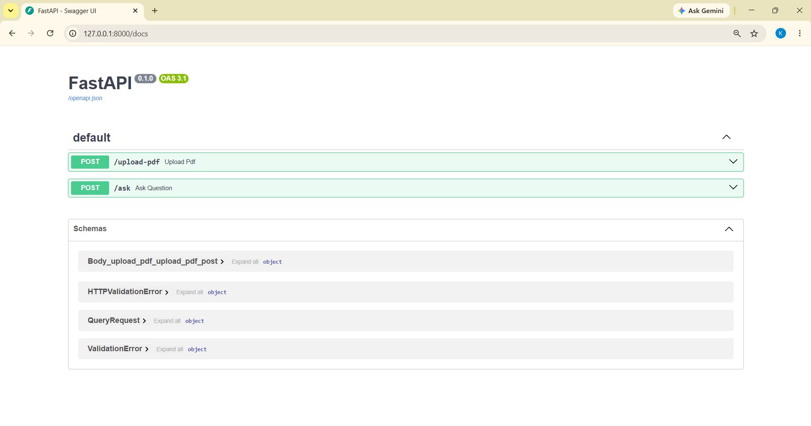
</p>

<p align="center">
  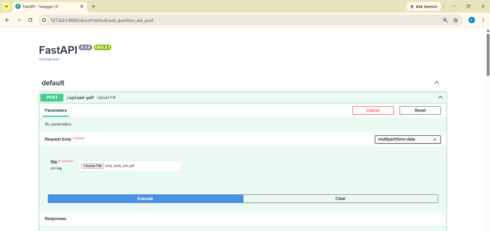
</p>

<p align="center">
  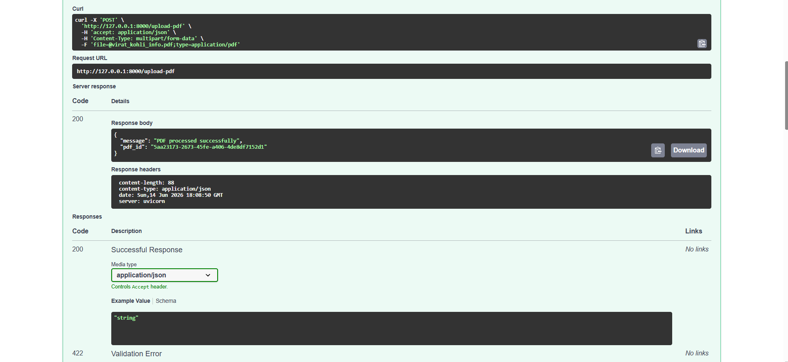
</p>

<p align="center">
  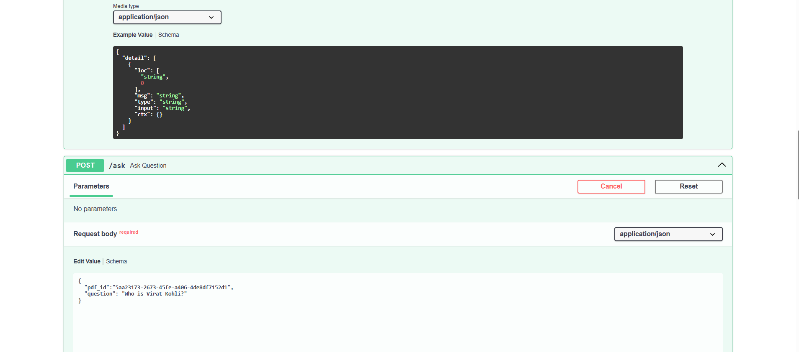
</p>

<p align="center">
  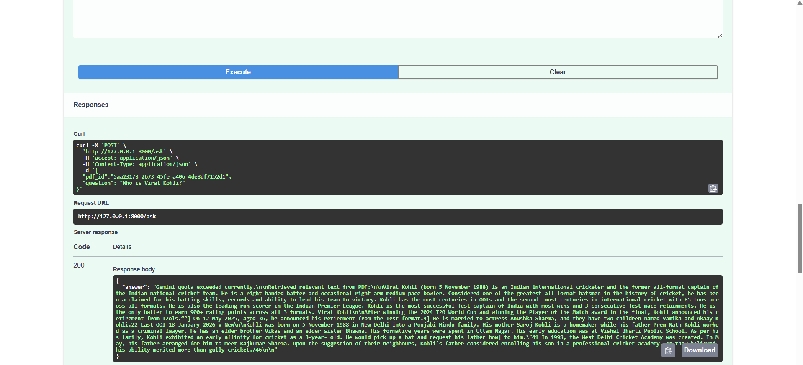
</p>

<p align="center">
  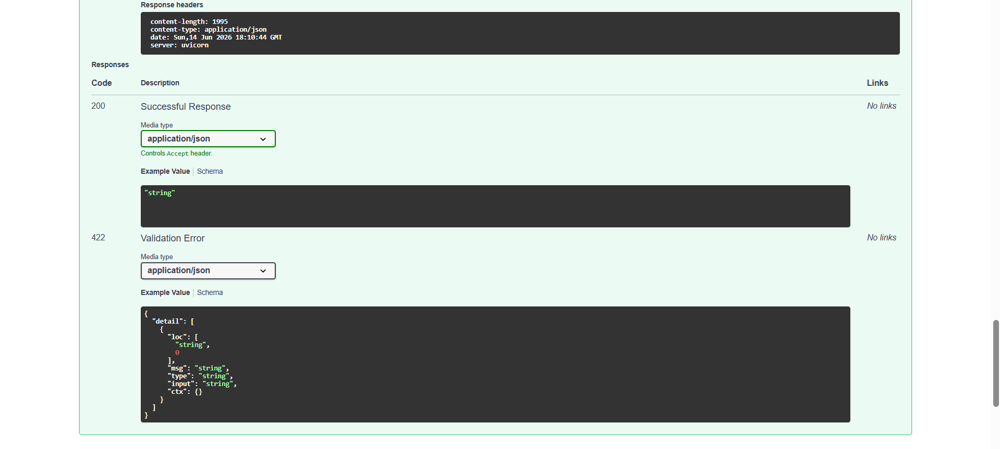
</p>

---

# 📸 Streamlit User Interface

<p align="center">
  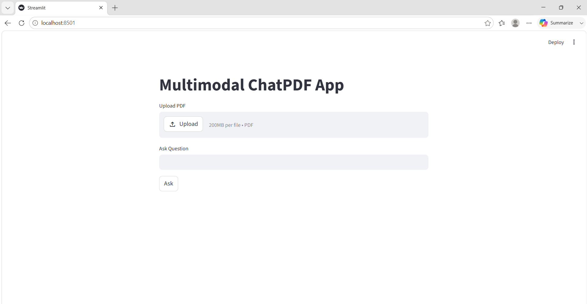
</p>

<p align="center">
  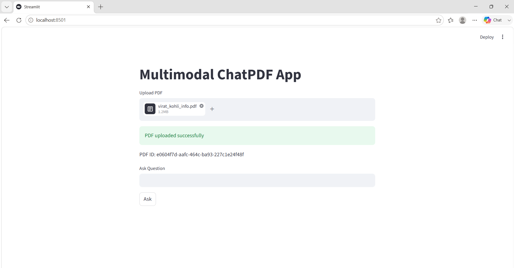
</p>

<p align="center">
  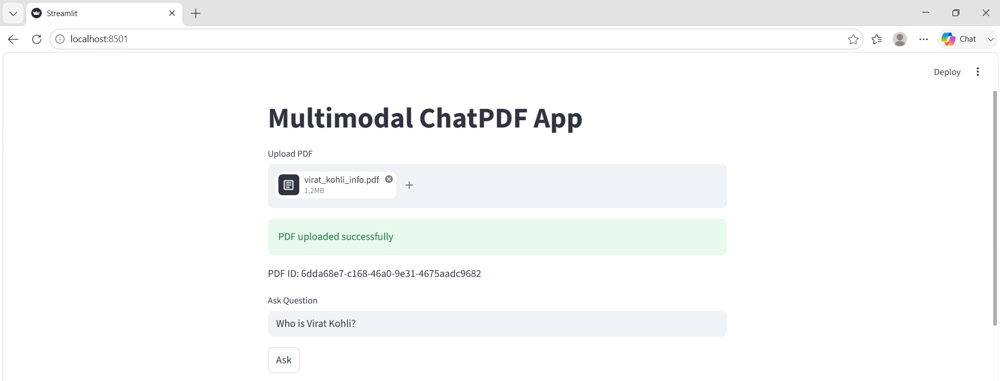
</p>

<p align="center">
  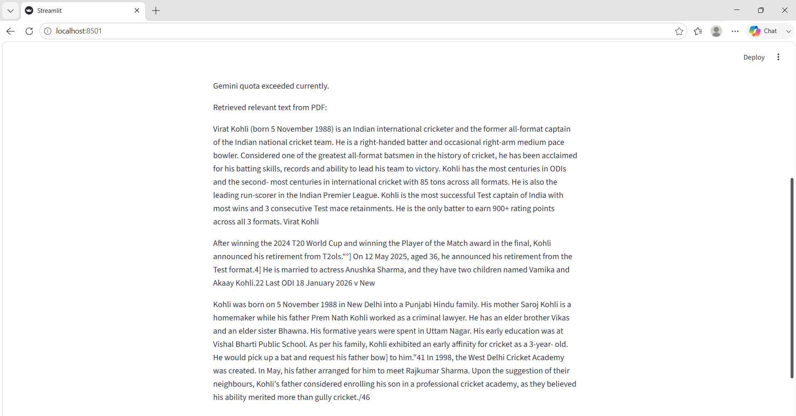
</p>

---

# 🔄 Workflow

```text
User Uploads PDF
        │
        ▼
PDF Processing
        │
        ▼
Text Extraction
        │
        ▼
Generate Embeddings
        │
        ▼
Store in ChromaDB
        │
        ▼
User Question
        │
        ▼
Similarity Search
        │
        ▼
Relevant Context Retrieval
        │
        ▼
Gemini LLM
        │
        ▼
Final Answer
```

---

# 🎓 Learning Outcomes

Through this project I learned:

* Retrieval-Augmented Generation (RAG)
* Vector Databases
* Embedding Models
* FastAPI Development
* Streamlit Development
* Docker Containerization
* LLM Integration
* Production Project Structure
* API Design
* End-to-End AI Application Development

---

# 👨‍💻 Author

**Kaushal Gumphalwar**

Machine Learning | Generative AI | LLM Applications | FastAPI | Docker

GitHub: https://github.com/KaushalGumphalwar

---

# ⭐ If you found this project useful

Please consider giving this repository a star ⭐ on GitHub.
